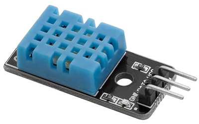
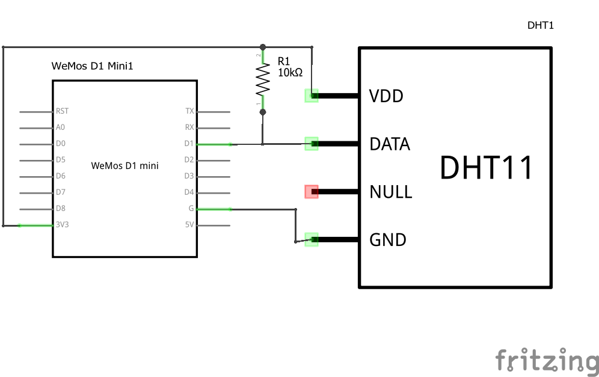
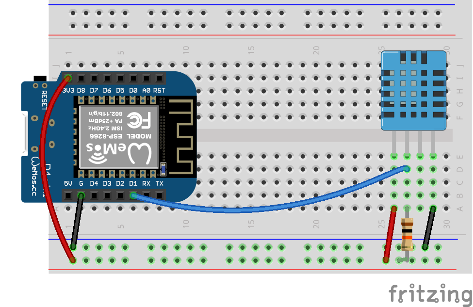

# Lab Exercise - ESP8266 and DHT11 Temperature-Humidity Sensor

This lab will introduce students to sensors and serial communication, using a DHT11 temperature and humidity sensor.

### DHT11 Temperature Humidity Sensor

The DHT11 is a low cost, temperature and humidity sensor. It communicates using a custom single wiring serial protocol. The DHT11 is a cheaper and less accurate version of the DHT22 sensor.

### Technical Specification

#### DHT11 (blue)

- 3 to 5V power and I/O
- 2.5mA max current draw
- 20-80% humidity range with 5% accuracy
- 0-50°C temperature range with ±2°C accuracy
- 1 Hz max sampling rate (once every second)

#### DHT22 / AM2302 (white)

- 3 to 5V power and I/O
- 2.5mA max current draw
- 0-100% humidity range with 2-5% accuracy
- -40 to 80°C temperature range with ±0.5°C accuracy
- 0.5 Hz max sampling rate (once every 2 seconds)

## Exercise 1

First, we will build and test a circuit using the temperature sensor.

#### Components Needed

* DHT11 sensor
* 10k ohm resistor (if using bare sensor)
* connecting wires
* esp8266 development board (e.g. Wemos D1 mini)

### Instructions

1. Wire up the components as shown in the diagrams. If the sensor is not on a breakout board, the data line needs to be pulled high using a 10k ohm resistor. If the sensor is on a breakout board, the pull-up resistor is probably also integrated on the breakout board.
   
   
    
   

   #### Default Pin Wiring

    | Pin No | Function | Device Connection |
    | --- | --- | --- |
    | 3V3 | +3.3V | Vdd |
    | G | GND | GND |
    | D1 | GPIO5 | Data |

   

2. Make sure the sensor is wired the correct way round!

3. **Make sure the sensor is wired the correct way round!** Pins on the breakout board maybe reversed from those in the diagram. Check the labels.

4. - If using Arduino IDE, open the [dht11-temperature-humidity-sensor](arduino/dht11-temperature-humidity-sensor/dht11-temperature-humidity-sensor.ino) sketch and run it.

   - If using micropython (i.e. with Thonny), run the [read_sensor.py](micropython/read_sensor.py) script.

5. Open the serial monitor / REPL and check that the sensor is working correctly.

Q1. What cable carries the data?

Q2. What libraries are needed to run this sketch?

Q3. What are libraries (in this context)? How are they helpful?

## Exercise 2

This exercise will add a trigger condition based on temperature.

### Instructions

1. Expand the previous circuit by adding an LED.

2. Write a program, that when the temperature goes above 24°C, the LED turns on. If the temperature is below 24°C the LED is off.

### Additional Exercise

1. Add several LEDs in a row to your circuit.

2. Write a program so that the LEDs turn on succession as the temperature increases.
